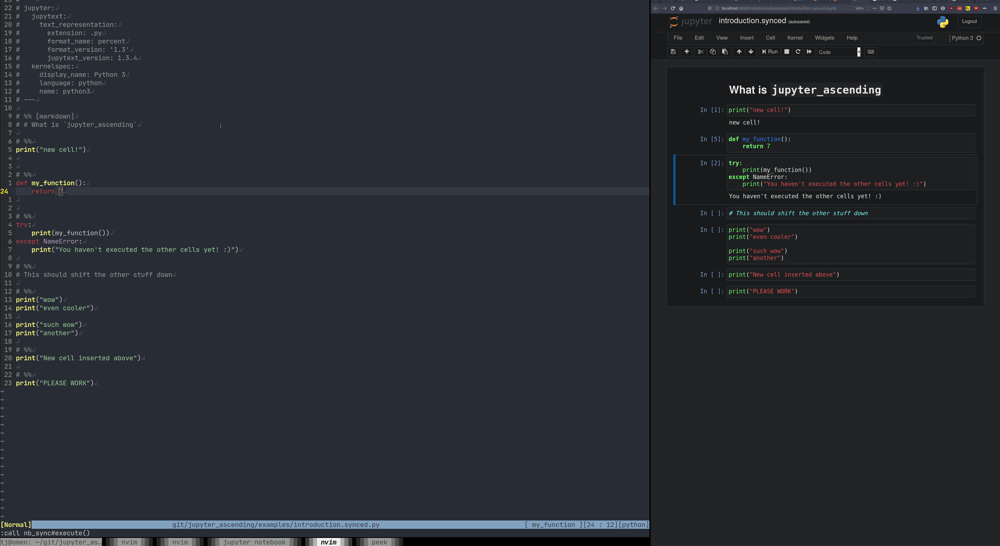
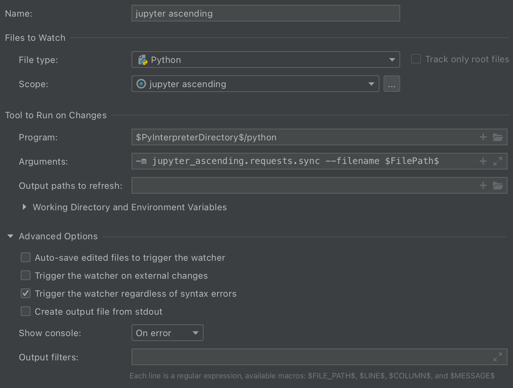
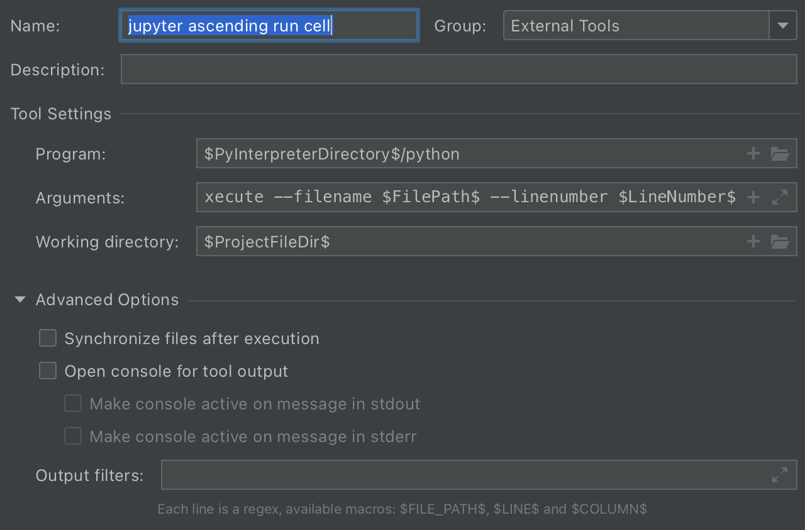

# jupyter_ascending

Sync Jupyter Notebooks from any editor



## About

Jupyter Ascending is a tool that enables you to edit Jupyter notebooks from your favorite code editor. You edit a normal python file, and Jupyter Ascending syncs the code into a Jupyter notebook. This allows you to keep everything you like about your editor/IDE, like keybindings, autocomplete, etc, while also being about to get the interactivity and visualization that Jupyter brings.

We generally will put an editor side-by-side with the Jupyter notebook open in a browser (as shown in the GIF above). You'll create a `my_cool_script.sync.py` file which is paired with `my_cool_script.sync.ipynb`. You edit your code in the `.sync.py` file, using `# %%` to indicate breaks between notebook cells. The code auto-syncs into the notebook using a hook/plugin in your editor that sends the code to a plugin in the Jupyter server. You can also forward keyboard shortcuts from your editor for notebook commands like "run cell", "run all cells", etc. That way, you never have to leave your editor, but can see all the outputs in the notebook as you run cells.

Because of the client-server architecture, you can also sync your code to a remote jupyter notebook. This lets you have all the power of a beefy dev-server with all the convenience of editing code locally.


## Installation

```
$ pip install jupyter_ascending
$ # It is possible you won't need to run the following commands on newer version of jupyter notebook,
$ # but it's recommended that you do anyway, because installing extensions is hard.
$ jupyter nbextension install --py --sys-prefix jupyter_ascending
$ jupyter nbextension     enable jupyter_ascending --sys-prefix --py
$ jupyter serverextension enable jupyter_ascending --sys-prefix --py
```

You can confirm it's installed by checking:
```
$ jupyter nbextension     list
$ jupyter serverextension list
```


## Getting started

To get a pair of synced py and ipynb files, run the following, where `--base` is the base filename to which `.sync.py` and `.sync.ipynb` will be added:

```
$ python -m jupyter_ascending.scripts.make_pair --base examples/test
```

This will create a pair of files: `examples/test.sync.py` and `examples/test.sync.ipynb`.


To manually test the ability to sync between a paired python file and a notebook, open up the notebook, and run this python command. You should see the contents of the python file appear in the notebook:

`python -m jupyter_ascending.requests.sync --filename /full/path/to/file.sync.py`

Note that currently Jupyter Ascending expects the jupyter server to be running at `localhost:8888`. If it's running elsewhere, you'll need to set the env variables `JUPYTER_ASCENDING_EXECUTE_HOST` and `JUPYTER_ASCENDING_EXECUTE_PORT` appropriately both where you use the client (ie in your editor) and where you start the server.

By default the Jupyter server will search for a free port starting at 8888. If 8888 is unavailable and it selects eg 8889, Jupyter Ascending won't work - as it's expecting to connect to 8888. To force Jupyter to use a specific port, start your jupyter notebook with `JUPYTER_PORT=8888 JUPYTER_PORT_RETRIES=0 jupyter notebook` (or whatever port you want, setting also `JUPYTER_ASCENDING_EXECUTE_PORT` appropriately).

## Security Warning!!

The jupyter-ascending client-server connection is currently completely unauthenticated, even if you have auth enabled on the Jupyter server. This means that, if your jupyter server port is open to the internet, someone could detect that you have jupyter-ascending running, then sync and run arbitrary code on your machine. That's bad!!

For the moment, we recommend only running jupyter-ascending when you're using jupyter locally, or when your jupyter server isn't open to the public internet. For example, we run Jupyter on remote servers, but keep Jupyter accessible only to localhost. Then we use a secure SSH tunnel to do port-forwarding.

Hopefully we can add authentication in the future - it's just rather tricky because there are various forms of auth accepted by Jupyter and not all of them are convenient to integrate into our clients (eg IDE integrations). We welcome contributions here!

## How it works

- your editor calls the jupyter ascending client library with one of a few commands:
    - sync the code to the notebook (typically on save)
    - run a cell / run all cells / other commands that should be mapped to a keyboard shortcut
- the client library assembles a HTTP POST request and sends it to the jupyter server
- there is a jupyter server extension which accepts HTTP POST requests at `http://[jupyter_server_url]:[jupyter_server_port]/jupyter_ascending`.
- the server extension matches the request filename to the proper running notebooks and forwards the command along to the notebook plugin
- a notebook plugin receives the command, and updates the contents of the notebook or executes the requested command.
- the notebook plugin consists of two parts - one part executes within the python process of the notebook kernel, and the other executes in javascript in the notebook's browser window. the part in python launches a little webserver in a thread, which is how it receives messages the server extension. when the webserver thread starts up, it sends a message to the server extension to "register" itself so the server extension knows where to send commands for that notebook.

## Working on a remote server

Because of the client-server architecture, Jupyter Ascending doesn't know or care if the editor and the jupyter server are on the same machine. The client is just sending requests to `http://[jupyter_server_url]:[jupyter_server_port]/jupyter_ascending`, with the default set to `http://localhost:8888/jupyter_ascending`. We typically use SSH to forward the remote jupyter port into `localhost:8888`, but you can set up the networking however you like, and use the environment variables to tell the client where to look for the Jupyter server.

There's fuzzy-matching logic to match the locally edited file path with the remote notebook file path (eg if the two machines have the code in a different directory), so everything should just work!


## Usage in PyCharm

You'll want to set PyCharm up so that it runs `jupyter_ascending.requests.sync` every time you save a `.sync.py` file. This can be done with a File Watcher (preferences->file watcher).



You'll need to make a custom file watcher scope: `file:*.sync.py`

Then, if you want to set a keyboard shortcut in PyCharm for "run cell" in the notebook (handy if you have the editor and notebook windows side by side), you can do it by setting up an External Tool (preferences->external tools).



The argument command that got cut off there is `jupyter_ascending.requests.execute --filename $FilePath$ --linenumber $LineNumber$`

You'll have to set up a keyboard shortcut for this external tool in the keyboard shortcuts menu.


## Usage in Vim

To use in vim, see: [jupyter_ascending.vim](https://github.com/untitled-ai/jupyter_ascending.vim)


## Usage in other editors

To use Jupyter Ascending in a different editor, you just need to be able to set up a few hooks:

On file save (only execute on files with extension `.sync.py`):

`python -m jupyter_ascending.requests.sync --filename [file_path]`

Then you can map keyboard shortcuts to:


Run cell:

`python jupyter_ascending.requests.execute --filename [file_path] --linenumber [line_number]`

The execution commands (run cell / run all cells) will sync the file before running the code, so you just need to make sure that the file is saved in order to run the current version of the code in your editor.


If you get this working in a new editor, we'd love if you would show us how you set it up!

## Local development

To do local development (only needed if you're modifying the jupyter-ascending code):

```
# install dependencies
$ poetry install

# Installs the extension, using symlinks
$ jupyter nbextension install --py --sys-prefix --symlink jupyter_ascending

# Enables them, so it auto loads
$ jupyter nbextension enable jupyter_ascending --py --sys-prefix
$ jupyter serverextension enable jupyter_ascending --sys-prefix --py
```

To check that they are enabled, do something like this:

```
$ jupyter nbextension list
Known nbextensions:
  config dir: /home/tj/.pyenv/versions/3.8.1/envs/general/etc/jupyter/nbconfig
    notebook section
      jupytext/index  enabled
      - Validating: OK
      jupyter-js-widgets/extension  enabled
      - Validating: OK
      jupyter_ascending/extension  enabled
      - Validating: OK

$ jupyter serverextension list
config dir: /home/tj/.pyenv/versions/3.8.1/envs/general/etc/jupyter
    jupytext  enabled
    - Validating...
      jupytext 1.8.0 OK
    jupyter_ascending  enabled
    - Validating...
      jupyter_ascending 0.1.13 OK
```

Run tests from the root directory of this repository using `python -m pytest .`.

Format files with `pyfixfmt`. In a PyCharm file watcher, something like

```python -m pyfixfmt --file-glob $FilePathRelativeToProjectRoot$ --verbose```