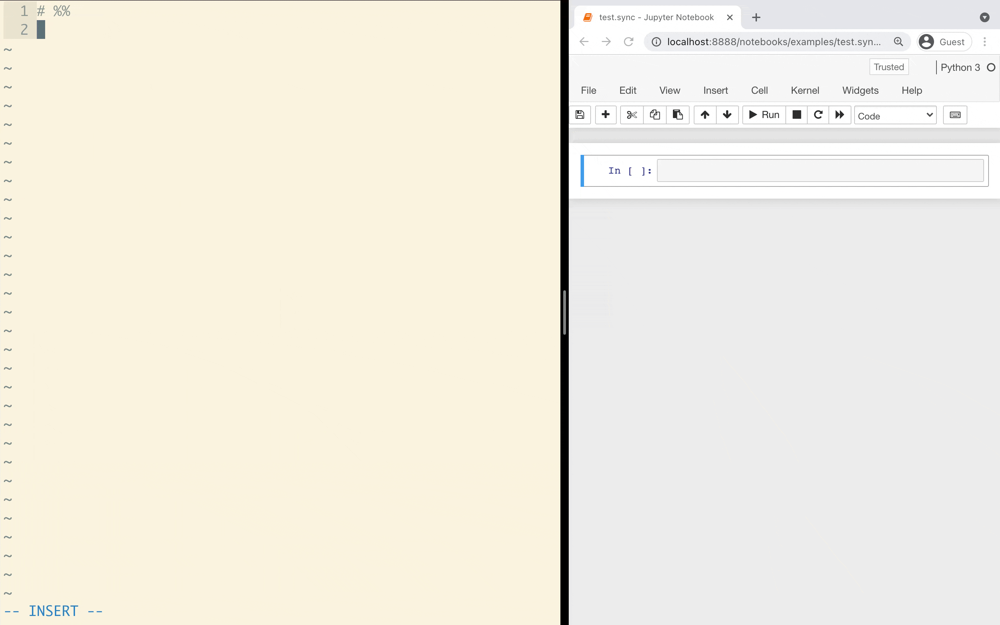

# Jupyter Ascending

Sync Jupyter Notebooks from any editor



## About

Jupyter Ascending lets you edit Jupyter notebooks from your favorite editor, then instantly sync and execute that code in the Jupyter notebook running in your browser.

It's the best of both worlds--the autocomplete, keybindings, and refactoring tools you love in your favorite editor, plus the great visualization abilities of a Jupyter notebook.

Combined with basic syncing of your code to a remote server, you can have all the power of a beefy dev-server with all the convenience of editing code locally.


## Installation

```
$ pip install jupyter_ascending && \
python -m jupyter nbextension    install jupyter_ascending --sys-prefix --py && \
python -m jupyter nbextension     enable jupyter_ascending --sys-prefix --py && \
python -m jupyter serverextension enable jupyter_ascending --sys-prefix --py
```

You can confirm it's installed by checking for `jupyter_ascending` in:
```
$ python -m jupyter nbextension     list
$ python -m jupyter serverextension list
```

If your jupyter setup includes multiple python kernels that you'd like to use with jupyter ascending, you'll need to complete this setup in each of those python environments separately.

## Usage

### Quickstart

1) `python -m jupyter_ascending.scripts.make_pair --base example`

   This makes a pair of synced py and ipynb files, `example.sync.py` and `example.sync.ipynb`.


2) Start jupyter and open the notebook:

   `python -m jupyter notebook example.sync.ipynb`


3) Add some code to the `.sync.py` file, e.g.

   `echo 'print("Hello World!")' >> example.sync.py`
   

4) Sync the code into the jupyter notebook:

   `python -m jupyter_ascending.requests.sync --filename example.sync.py`
   
5) Run that cell of code

   `python -m jupyter_ascending.requests.execute --filename example.sync.py --line 16`


Set up one of the editor integrations to do all of this from within your favorite editor!
- [Vim](https://github.com/untitled-ai/jupyter_ascending.vim)
- [Visual Studio Code](docs/VSCODE.md)
- [PyCharm](docs/PYCHARM.md)
- [Other editors](docs/OTHER_EDITORS.md)


### Working with multiple jupyter servers or alternate ports

Currently Jupyter Ascending expects the jupyter server to be running at `localhost:8888`. If it's running elsewhere (eg due to having multiple jupyter notebooks open), you'll need to set the env variables `JUPYTER_ASCENDING_EXECUTE_HOST` and `JUPYTER_ASCENDING_EXECUTE_PORT` appropriately both where you use the client (ie in your editor) and where you start the server.

By default the Jupyter server will search for a free port starting at 8888. If 8888 is unavailable and it selects eg 8889, Jupyter Ascending won't work - as it's expecting to connect to 8888. To force Jupyter to use a specific port, start your jupyter notebook with `JUPYTER_PORT=8888 JUPYTER_PORT_RETRIES=0 jupyter notebook` (or whatever port you want, setting also `JUPYTER_ASCENDING_EXECUTE_PORT` appropriately).

### Working on a remote server

Jupyter Ascending doesn't know or care if the editor and the jupyter server are on the same machine. The client is just sending requests to `http://[jupyter_server_url]:[jupyter_server_port]/jupyter_ascending`, with the default set to `http://localhost:8888/jupyter_ascending`. We typically use SSH to forward the local jupyter port into the remote server, but you can set up the networking however you like, and use the environment variables to tell the client where to look for the Jupyter server.

There's fuzzy-matching logic to match the locally edited file path with the remote notebook file path (eg if the two machines have the code in a different directory), so everything should just work!

Here's an example of how you could set this up:
1) install jupyter-ascending on both the client and the server
2) put a copy of your project code on both the client and the server
2) start a jupyter notebook on the server, and open a `.sync.ipynb` notebook
3) set up port forwarding, e.g. with something like this (forwards local port `8888` to the remote port `8888`)
   
   `ssh -L 8888:127.0.0.1:8888 user@remote_hostname`
4) use Jupyter Ascending clients as normal on the corresponding `.sync.py` file

## Security Warning

The jupyter-ascending client-server connection is currently completely unauthenticated, even if you have auth enabled on the Jupyter server. This means that, if your jupyter server port is open to the internet, someone could detect that you have jupyter-ascending running, then sync and run arbitrary code on your machine. That's bad!

For the moment, we recommend only running jupyter-ascending when you're using jupyter locally, or when your jupyter server isn't open to the public internet. For example, we run Jupyter on remote servers, but keep Jupyter accessible only to localhost. Then we use a secure SSH tunnel to do port-forwarding.

Hopefully we can add proper authentication in the future. Contributions are welcome here!


## How it works

- your editor calls the jupyter ascending client library with one of a few commands:
  - sync the code to the notebook (typically on save)
  - run a cell / run all cells / other commands that should be mapped to a keyboard shortcut
- the client library assembles a HTTP POST request and sends it to the jupyter server
- there is a jupyter server extension which accepts HTTP POST requests at `http://[jupyter_server_url]:[jupyter_server_port]/jupyter_ascending`.
- the server extension matches the request filename to the proper running notebooks and forwards the command along to the notebook plugin
- a notebook plugin receives the command, and updates the contents of the notebook or executes the requested command.
- the notebook plugin consists of two parts - one part executes within the python process of the notebook kernel, and the other executes in javascript in the notebook's browser window. the part in python launches a little webserver in a thread, which is how it receives messages the server extension. when the webserver thread starts up, it sends a message to the server extension to "register" itself so the server extension knows where to send commands for that notebook.

## Local development

To do local development (only needed if you're modifying the jupyter-ascending code):

```
# Install poetry system-wide (not the python package!)
# (https://python-poetry.org/docs/#installation)

# install dependencies (will install from the lock file)
$ poetry install

# Activate the poetry env
$ poetry shell

# Installs the extension, using symlinks
$ jupyter nbextension install --py --sys-prefix --symlink jupyter_ascending

# Enables them, so it auto loads
$ jupyter nbextension enable jupyter_ascending --py --sys-prefix
$ jupyter serverextension enable jupyter_ascending --sys-prefix --py
```

To check that they are enabled, do something like this:

```
$ jupyter nbextension list
Known nbextensions:
  config dir: /home/tj/.pyenv/versions/3.8.1/envs/general/etc/jupyter/nbconfig
    notebook section
      jupytext/index  enabled
      - Validating: OK
      jupyter-js-widgets/extension  enabled
      - Validating: OK
      jupyter_ascending/extension  enabled
      - Validating: OK

$ jupyter serverextension list
config dir: /home/tj/.pyenv/versions/3.8.1/envs/general/etc/jupyter
    jupytext  enabled
    - Validating...
      jupytext 1.8.0 OK
    jupyter_ascending  enabled
    - Validating...
      jupyter_ascending 0.1.13 OK
```

Run tests from the root directory of this repository using `python -m pytest .`.

Format files with `pyfixfmt`. In a PyCharm file watcher, something like

```python -m pyfixfmt --file-glob $FilePathRelativeToProjectRoot$ --verbose```

Pushing a new version to PyPI:
- Bump the version number in `pyproject.toml` and `_version.py`.
- `poetry build`
- `poetry publish`
- `git tag VERSION` and `git push origin VERSION`

Updating dependencies: 
- Dependency constraints are in `pyproject.toml`.
  These are the constraints that will be enforced when distributing the package to end users.
- These get locked down to specific versions of each package in `poetry.lock`, when you run `poetry lock` or `poetry install` for the first time. `poetry.lock` is only used by developers using `poetry install` - the goal is to have a consistent development environment for a all developers.
- If you make a change to the dependencies in `pyproject.toml`, you'll want to update the lock file with `poetry lock`. To get only the minimal required changes, use `poetry lock --no-update`.
